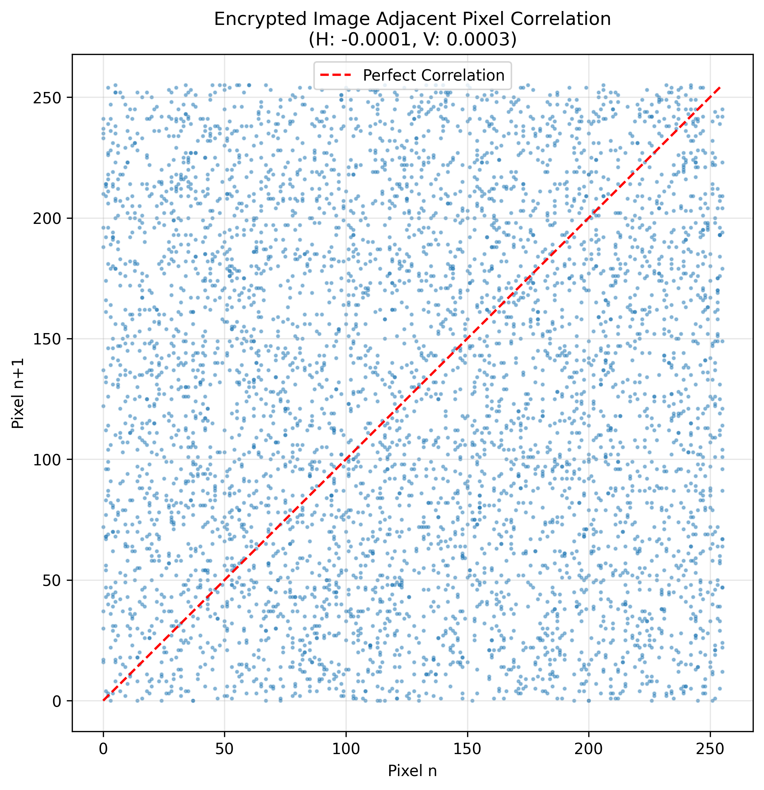
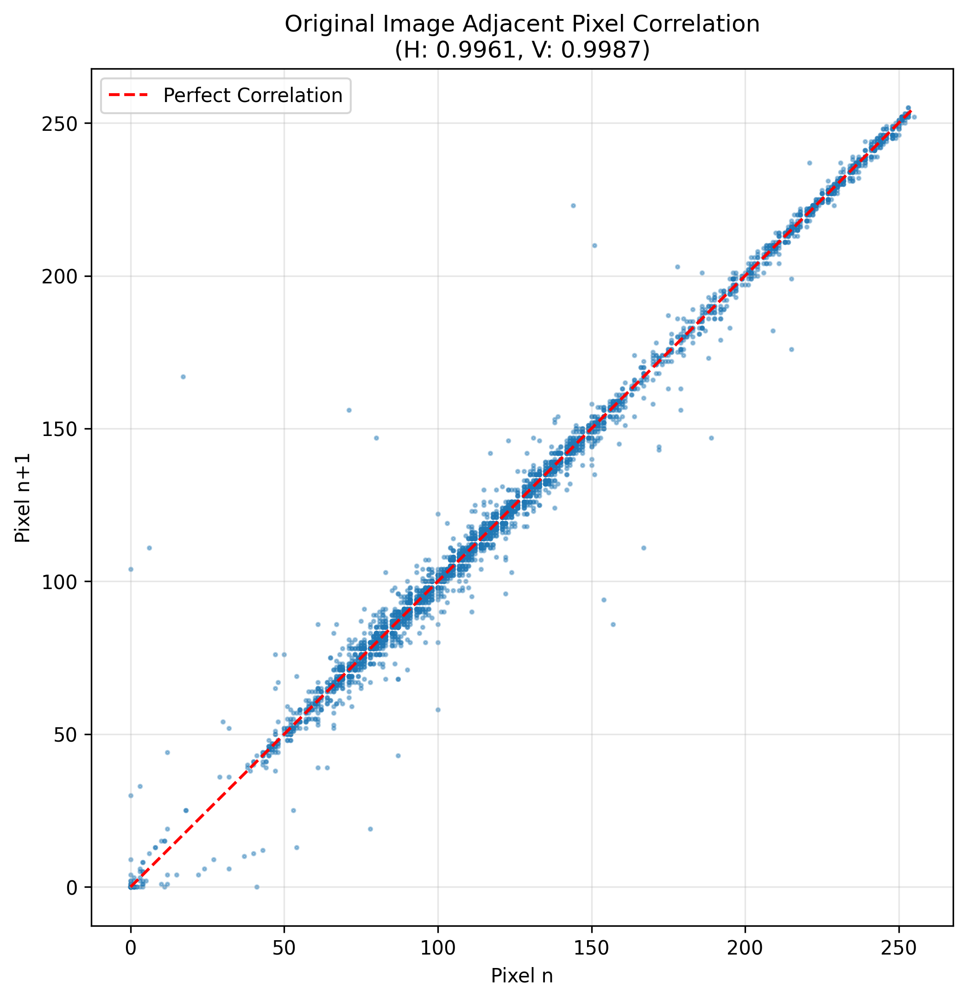
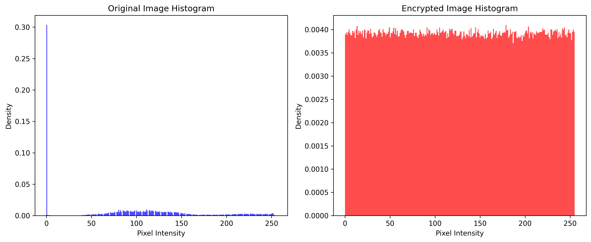
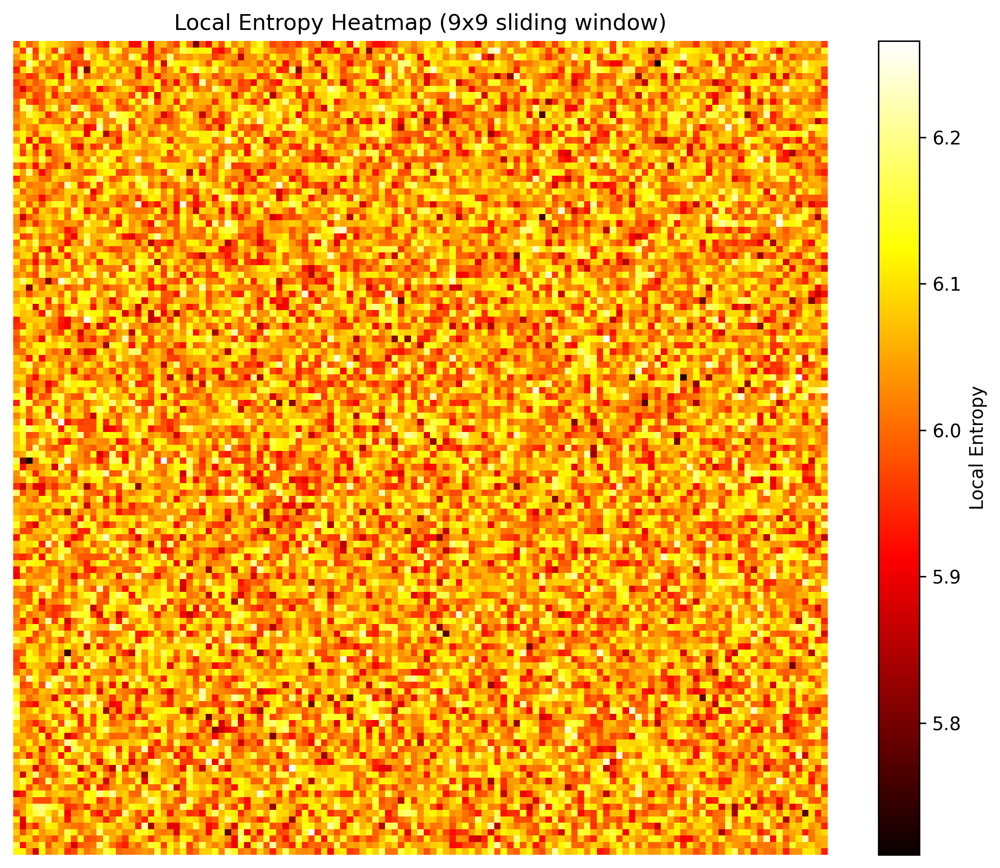
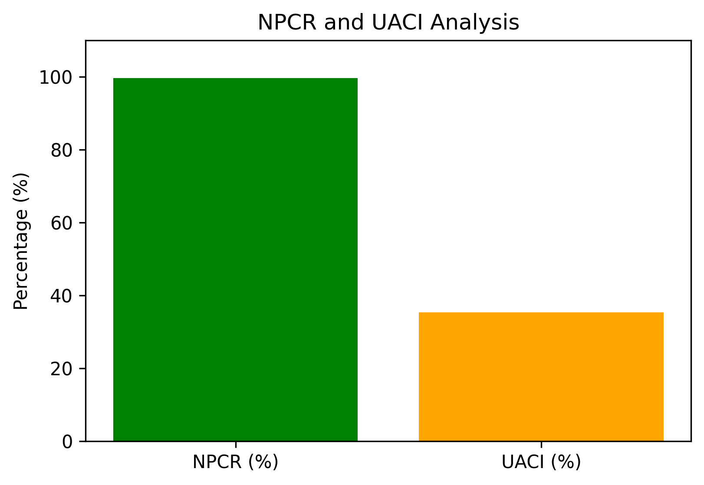

# 🔐 Secure DICOM Transmission System

A production-style system for secure medical image transmission using hybrid cryptography, access control, and cryptographic validation.

---

## 🚀 Overview

This system enables secure transmission of DICOM medical images by combining symmetric and asymmetric cryptography with authentication and audit mechanisms.

It ensures:
- Confidentiality (AES encryption)
- Integrity (digital signatures)
- Authenticity (RBAC + JWT)
- Secure delivery of medical data

---

## 🔐 Key Features

- Hybrid encryption using **AES-256-GCM + RSA-2048**
- Digital signatures using **RSA-PSS** for tamper detection
- Role-Based Access Control (**RBAC**) with JWT authentication
- Secure pipeline (upload → encrypt → transmit → decrypt)
- Nonce-based replay protection
- Audit logging for traceability

---

## 🧠 System Architecture

```
Client (Doctor / Patient)
        |
Frontend (React UI)
        |
Backend API (Flask + RBAC + JWT)
        |
Encryption Engine (AES-GCM + RSA + Signature)
        |
Secure Package (.smt)
        |
Transmission Layer (Email)
        |
Receiver → Verification → Decryption → Access Control

```

## 🔬 Security Validation

| Metric | Value |
|------|------|
| Entropy | ~7.99 |
| NPCR | ~99.6% |
| UACI | ~35% |
| Correlation | ~0 |

These results demonstrate strong resistance against statistical and differential attacks.

---

## 📸 System Demonstration

- 🔑 Encryption Workflow: Upload → Encrypt → Secure Package (.smt)
- 📊 Security Metrics: Entropy, NPCR, UACI, Correlation
- 🔍 Analysis: Histogram comparison, pixel correlation, entropy distribution

---

## 📊 Security Analysis & Validation

### 🔍 Correlation Analysis



- Original image shows high correlation → predictable structure  
- Encrypted image shows near-zero correlation → randomness achieved  

---

### 📈 Histogram Comparison


- Original histogram is non-uniform  
- Encrypted histogram is uniform → data hidden  

---

### 🔥 Entropy Heatmap


- High entropy across image  
- Confirms strong randomness (~8 for 8-bit images)  

---

### ⚡ NPCR & UACI


- NPCR ≈ 99.6% → strong diffusion  
- UACI ≈ 33% → optimal intensity variation  

---

## ⚙️ Setup & Run

### Backend
```bash
pip install -r requirements.txt
python manage.py 

```

---

##  Frontend
```bash
cd frontend
npm install
npm run dev

```

---


## Test Flow

- Upload DICOM file
- Encrypt and send
- Receive secure package
- Decrypt and verify integrity

---


##  🛠️ Tech Stack

- Backend: Flask, SQLAlchemy
- Frontend: React (Vite)
- Cryptography: AES-GCM, RSA-2048, RSA-PSS
- Data Processing: pydicom, NumPy

---

## 📊 Key Highlights

- End-to-end secure DICOM transmission pipeline
- Backend-driven encryption architecture
- Real cryptographic validation using entropy and diffusion metrics
- Designed for healthcare-grade data security use cases

---

## ❗ Problem Statement

 Medical image transmission systems often lack end-to-end encryption and proper authentication mechanisms, exposing sensitive patient data to interception, tampering, and replay attacks. 

 This system addresses: 
 - Secure transmission of DICOM images 
 - Data authenticity verification
 - Protection against unauthorized access and replay attacks

  ---

  ## ⚙️ Implementation Details

- AES-256-GCM used for pixel data encryption (confidentiality + integrity)
- RSA-2048 (OAEP) used for secure key exchange
- RSA-PSS used for digital signatures 
- JWT-based authentication with RBAC enforcement 
- Nonce-based replay protection mechanism 
- Audit logging for security monitoring 

--- 

## ⚠️ Limitations

- Backend-side encryption (not zero-knowledge architecture) 
- Replay protection is partial 
- Local key storage (no HSM/KMS integration) 
- SQLite not suitable for high-scale production 

--- 

## 🚀 Future Improvements 

- Client-side encryption (true zero-knowledge system) 
- Cloud Key Management (AWS KMS / HSM) 
- PostgreSQL migration 
- Full replay attack prevention system 
- Secure transport protocols (mTLS, HTTPS enforcement) 

--- 

## 📌 Conclusion

 This project demonstrates a secure and scalable approach to medical image transmission using modern cryptographic techniques. 

 It balances: 
 - Security 
 - Performance 
 - Practical implementation constraints and serves as a strong foundation for real-world healthcare data systems.
